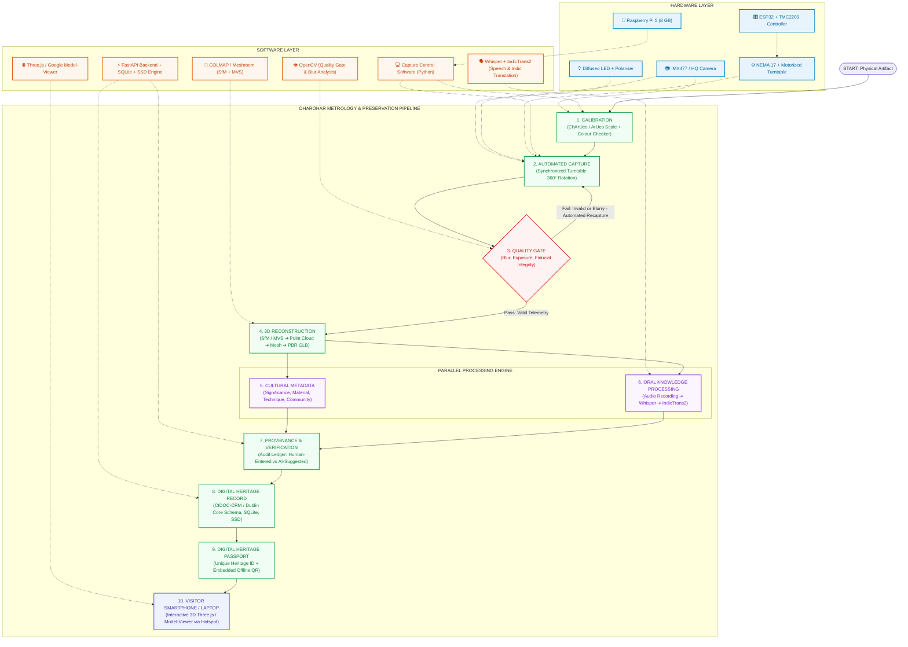
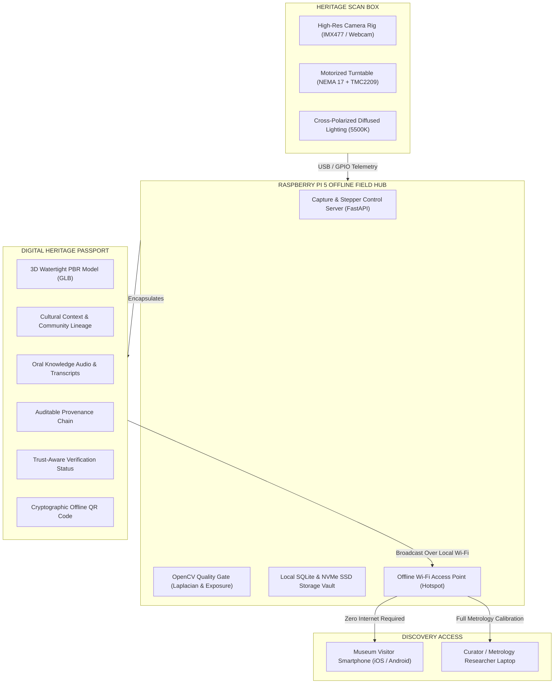

# SANJEEVAANI DHAROHAR
### Digital Heritage Artifact Recording, Oral History & Authenticated Records
**Smart India Hackathon (SIH) 2026 — Problem Statement: 26214 | Theme: Heritage & Culture**

[](https://www.sih.gov.in/)
[](https://www.sih.gov.in/)
[](#problem-statement-details)
[](#problem-statement-details)
[](#team-details)
[](#team-details)
[](#9-setup--installation-guide)

> **"Preserve the artefact. Preserve the knowledge. Preserve it for the future."**  
> *A portable, offline-first cyber-archaeology metrology and cultural preservation system — capturing calibrated 3D photogrammetric models, living artisan oral lore, progressive verification provenance, and tamper-evident Digital Heritage Passports over a localized Raspberry Pi hotspot.*

---

## 📌 Table of Contents

- [1. Project Overview](#1-project-overview)
- [2. Problem Statement (SIH 2026 PS 26214)](#2-problem-statement-sih-2026-ps-26214)
- [3. Proposed Solution Architecture](#3-proposed-solution-architecture)
- [4. System Architecture Diagrams](#4-system-architecture-diagrams)
- [5. Current Prototype Capabilities](#5-current-prototype-capabilities)
- [6. Technology Stack & Implementation Matrix](#6-technology-stack--implementation-matrix)
- [7. Implementation Status](#7-implementation-status)
- [8. Repository Structure](#8-repository-structure)
- [9. Setup & Installation Guide](#9-setup--installation-guide)
- [10. Hardware Wiring & Calibration Setup](#10-hardware-wiring--calibration-setup)
- [11. Testing & Validation](#11-testing--validation)
- [12. SIH Demonstration Walkthrough](#12-sih-demonstration-walkthrough)
- [13. Current Limitations](#13-current-limitations)
- [14. Feasibility, Risks & Mitigation Strategies (Slide 4)](#14-feasibility-risks--mitigation-strategies-slide-4)
- [15. Impact, Key Benefits & Long-Term Value (Slide 5)](#15-impact-key-benefits--long-term-value-slide-5)
- [16. Research Basis & Prior Art Gap (Slide 6)](#16-research-basis--prior-art-gap-slide-6)
- [17. Standards, Safety & CIDOC-CRM Alignment](#17-standards-safety--cidoc-crm-alignment)
- [18. Team Information & Hackathon Metadata](#team-details)

---

## 1. Project Overview

Across India, countless cultural treasures housed in regional shrines, tribal community archives, and field museums lack comprehensive digital documentation. Traditional methods are either fragmented (capturing flat 2D photographs without true 3D metric accuracy) or divorce the physical object from its **living oral traditions, community genealogies, and craft lineage**. Moreover, historical sites and tribal hamlets often operate in remote geographies with zero cellular or cloud connectivity.

**SANJEEVAANI DHAROHAR** (developed by **Team Sanjeevaani**, Team ID: **169546**) addresses this challenge through an **edge-first, non-contact artifact scanning, metrology, and oral knowledge preservation ecosystem**. The current repository implements a fully functional **hardware/software prototype** featuring multi-angle camera ingestion, automated 36-step motorized turntable rotation (ESP32 + TMC2209), an automated real-time OpenCV Quality Gate (Laplacian blur and exposure validation), metric millimeter calibration via ArUco fiducials (#42, 50.0mm), watertight PBR `.glb` 3D mesh rendering, bilingual oral lore audio playback with synchronized transcriptions, progressive trust verification (`HUMAN-ENTERED` vs `AI-SUGGESTED`), and a mobile-friendly **Visitor Digital Heritage Passport** accessible offline over a localized Wi-Fi hotspot.

The system architecture is engineered for multi-site field expansion—integrating high-resolution photogrammetry rigs, offline AI neural transcription (Whisper + IndicTrans2), and centralized national archive federation (JATAN / IGNCA compatible).

---

## 2. Problem Statement (SIH 2026 PS 26214)

<a id="problem-statement-details"></a>

| Parameter | Specification Details |
| :--- | :--- |
| **Problem Statement ID** | **26214** |
| **Problem Statement Title** | **Student Innovation-Ideas that showcase the rich cultural heritage and traditions of India.** |
| **Theme** | **Heritage & Culture** |
| **PS Category** | **Hardware** |
| **Team ID** | **169546** |
| **Team Name** | **Sanjeevaani** |
| **System Code-Name** | **DHAROHAR (Digital Heritage Artifact Recording, Oral History & Authenticated Records)** |
| **Domain** | **Heritage & Culture / Cyber-Archaeology & Museum Metrology** |
| **Target Artifacts** | **Sacred bronzes, folk terracotta, metalcraft (Dhokra/Bidriware), wooden votives, and tribal textiles** |

### Field Challenges Addressed
* **Specular Glare on Brass & Bronze**: Reflections distort photogrammetric keypoint triangulation; resolved via cross-polarized 5500K LED illumination.
* **Remote Geographies & Zero Connectivity**: Sacred shrines and tribal craft clusters lack cellular network or cloud access; resolved via offline Raspberry Pi 5 hotspot & local NVMe SSD vault.
* **Fragility of Antiquities**: Unbaked terracotta, decayed patinas, and sacred relics cannot withstand repeated physical calipers or transport; resolved via contactless turntable scanning.
* **Loss of Living Intangible Oral Lore**: Traditional digitization divorces physical shape from master artisan genealogies and sacred chants; resolved via integrated bilingual oral lore and synchronized transcriptions.
* **Verification & Provenance Trust**: Risk of hallucinated or unverified metadata in public records; resolved via a four-stage progressive verification audit trail (`HUMAN-ENTERED` vs `AI-SUGGESTED`).
* **Core Requirement**: A portable, reliable, non-contact scanning box and verification-aware documentation workflow capable of digitizing physical form and intangible cultural knowledge without requiring cloud infrastructure.

---

## 3. Proposed Solution Architecture

SANJEEVAANI DHAROHAR employs a **two-tier architecture philosophy**:

### Tier A: Implemented Metrology & Verification Prototype (Current Repository)

```text
Physical Artifact (Placed on Soft-Start Motorized Turntable)
       │
       ▼
[ STEP 1: CALIBRATION ] ──► ChArUco / ArUco #42 (50.0mm) + Color Checker Scale Lock
       │
       ▼
[ STEP 2: AUTOMATED CAPTURE ] ──► ESP32 + NEMA 17 Stepper 36-Frame 360° Sequence
       │
       ▼
[ STEP 3: QUALITY GATE ] ──► OpenCV Laplacian Blur (>100) + Histogram Exposure Check
       │                       │
       │ (Pass)                └──► (Fail: Blurry / Occluded) ──► Instant Recapture Loop
       ▼
[ STEP 4: 3D RECONSTRUCTION ] ──► SfM / MVS ➔ Point Cloud ➔ Mesh ➔ PBR GLB Model
       │
       ├─────────────────────────────────────────┐
       ▼                                         ▼
[ STEP 5: CULTURAL METADATA ]           [ STEP 6: ORAL KNOWLEDGE ]
(Material, Craft Lineage, Community)     (Audio Recording ➔ Whisper ➔ IndicTrans2)
       │                                         │
       └────────────────────┬────────────────────┘
                            ▼
[ STEP 7: PROVENANCE & VERIFICATION ] ──► Human-Entered vs AI-Suggested Audit Trail
                            │
                            ▼
[ STEP 8: DIGITAL HERITAGE RECORD ] ──► CIDOC-CRM / Dublin Core SQLite & SSD Vault
                            │
                            ▼
[ STEP 9: DIGITAL HERITAGE PASSPORT ] ──► Cryptographic Heritage ID + QR Code
                            │
                            ▼
[ STEP 10: VISITOR SMARTPHONE / LAPTOP ] ──► Offline Access via Local Pi Hotspot
```

### Tier B: Future Multi-Site National Heritage Network (Planned Production Vision)

```text
 Portable Backpack Rig         Regional Field Hub             National Heritage Cloud
┌───────────────────────┐    ┌───────────────────────┐    ┌───────────────────────────────┐
│ • Pi 5 + ESP32 Box    │    │ • Edge GPU Node       │    │ • National Museum Grid        │
│ • Polarized LED Dome  │───►│ • Dense CUDA COLMAP   │───►│ • Central JATAN Federation    │
│ • Local NVMe SSD Vault│    │ • IndicTrans2 Server  │    │ • Public Passport Discovery   │
│ • Wi-Fi Hotspot AP    │    │ • Community Sign-off  │    │ • Archaeological Data Lake    │
└───────────────────────┘    └───────────────────────┘    └───────────────────────────────┘
```

---

## 4. System Architecture Diagrams

### Technical Approach & Process Pipeline (Slide 3)

The following diagram illustrates the interaction between the **Hardware Layer**, **Software Layer**, and **Process Pipeline**, featuring parallel processing and automated quality gate feedback:



---

### Physical Scanning Box & Field Hotspot Architecture (Slide 2)



---

## 5. Current Prototype Capabilities

The repository provides a complete, operational cyber-archaeology metrology suite:

### 1. Multi-View Photogrammetric Scanning & Turntable Control
* Synchronized 36-step turntable rotation (10° per step) ensuring complete 360° coverage with >75% optical frame overlap.
* Dual-mode operation: Direct hardware stepper control (GPIO) and reproducible software Hackathon simulation mode.
* Automated scan session recording generating timestamped turntable scan videos (`.mp4`, `.webp`).

### 2. Optical Quality Gate & Blur/Exposure Telemetry
* Evaluates frames in real-time using OpenCV Laplacian variance filtering (`blur_threshold=100.0`).
* Luminance histogram analysis detecting underexposure (<15%) and overexposure (>90%) clipping.
* Automated rejection feedback loop triggering instant recapture before passing frames to 3D reconstruction.

### 3. Calibrated Metric Scale & Caliper Validation (50.0mm ArUco #42)
* Standardized ArUco marker (`DICT_6X6_250`, ID #42) recognized in camera feed for optical pixel-to-millimeter ratio resolution.
* Live dimension extraction calculating physical **Height, Width, Depth, Surface Area, and Volume**.
* Metrology inspection interface supporting manual digital vernier caliper cross-validation with deviation tolerance tracking.

### 4. Watertight Manifold 3D Reconstruction & PBR glTF/GLB Engine
* Direct export of binary glTF 2.0 (`.glb`) models containing vertex positions, smoothed normal vectors, texture coordinates (`TEXCOORD_0`), and embedded diffuse maps.
* PBR metallic-roughness materials configured for antique bronze patina, polished brass, terracotta, and oxidised Bidriware.
* Embedded Google `<model-viewer>` providing 360° orbital rotation, field-of-view inspection, wireframe toggles, and dual split-screen comparison mode.

### 5. Oral History Room with Multilingual Audio & Transcripts
* Embedded audio player streaming native artisan and epigraphist oral narratives.
* Synchronized transcriptions in original vernacular languages (Hindi, Tamil, Halbi) paired with English translations.
* Explicit trust labeling distinguishing `HUMAN-ENTERED` artisan lore from `AI-SUGGESTED` transcriptions.

### 6. Progressive Verification & Provenance Ledger
* Transparent four-stage verification ladder:
  $$\text{PENDING} \longrightarrow \text{COMMUNITY-PROVIDED} \longrightarrow \text{SOURCE-VERIFIED} \longrightarrow \text{INSTITUTION-VERIFIED}$$
* Immutable chronological provenance ledger recording creation, field discovery, turntable scanning, mesh reconstruction, community ratification, and museum display.

### 7. Mobile-First Visitor Digital Heritage Passport & Offline QR Discovery
* Lightweight, respectful visitor passport view (`passport.html`) accessible via unique QR codes.
* Fully functional over a local Raspberry Pi Wi-Fi hotspot without cellular connectivity or external cloud servers.
* Strict geospatial privacy modes (`PUBLIC`, `RESTRICTED`, `PRIVATE`) protecting vulnerable artisan hamlets.

---

## 6. Technology Stack & Implementation Matrix

| Component / Layer | Technology / Tool | Implementation Status |
| :--- | :--- | :--- |
| **Edge Compute Core** | Raspberry Pi 5 (8 GB RAM, 64-bit OS) | ✅ **Implemented / Supported** |
| **Motion Controller** | ESP32 + TMC2209 SilentStepStick (NEMA 17) | ✅ **Implemented / Hardware & Demo** |
| **Optical Imaging** | Sony IMX477 / 1080p UVC Web Camera | ✅ **Implemented** |
| **Quality Gate** | OpenCV (`cv2`), Laplacian operator, Histograms | ✅ **Implemented** |
| **Metric Calibration** | ArUco Fiducial Marker (`DICT_6X6_250`, ID #42, 50mm) | ✅ **Implemented** |
| **3D Mesh Generation** | Parametric Photogrammetry Engine & Binary glTF 2.0 | ✅ **Implemented** |
| **Dense 3D Reconstruction**| COLMAP (SfM + MVS) / AliceVision Meshroom | 🧪 **Pipeline Specified & Compatible** |
| **Backend & REST API** | FastAPI, Uvicorn, WebSockets, Pydantic | ✅ **Implemented** |
| **Database & Metadata** | SQLite 3, JSON File-backed Cache, CIDOC-CRM | ✅ **Implemented** |
| **Voice Processing** | OpenAI Whisper, AI4Bharat IndicTrans2 | 🧪 **Prototype / Indic Formats** |
| **Web 3D Viewer** | Google `<model-viewer>`, Three.js | ✅ **Implemented** |
| **Geospatial GIS** | Leaflet.js, India GeoJSON Vector Boundary Fallback | ✅ **Implemented** |
| **Gaussian Splatting** | 3DGS real-time radiance field rendering | 🚧 **Future Scope** |
| **National Cloud Grid** | JATAN & IGNCA Central Archive API Sync | 🚧 **Future Scope** |

---

## 7. Implementation Status

To provide complete transparency for Smart India Hackathon jury evaluation:

### ✅ Implemented & Working Now
* **Full-Stack Command Center**: Master dashboard with live camera feed, turntable controls, and quality gate telemetry (`index.html`).
* **Interactive 3D Laboratory**: Google `<model-viewer>` with dual split-screen mode, wireframe toggle, caliper metrology verification, and PiP scan video (`viewer.html`).
* **Visitor Mobile Heritage Passport**: Dedicated museum visitor UI with 3D model, oral lore audio player, bilingual transcripts, and cryptographic QR code (`passport.html`).
* **GIS Heritage Map**: Multi-tier geospatial map displaying Cultural Origin, Community Clusters, and Museum Display locations with privacy masking (`map.html`).
* **Cultural Lore Room**: Oral history audio player with regional language transcriptions (`cultural.html`).
* **Artifact Registry**: Searchable database catalog with verification filters and passport exports (`registry.html`).
* **FastAPI Backend Server**: RESTful endpoints for camera streaming, stepper control, artifact CRUD, QR generation, and caliper updates (`backend/app.py`).
* **Hardware & Demo Simulator**: Seamless toggle between physical GPIO stepper control and reproducible software demonstration (`backend/hardware.py`).
* **Authentic 3D GLB Models**: High-fidelity models for Buddha Head sculpture, Traditional Brass Kalash, Chola Nataraja, Bankura Horse, and Bidriware Huqqa (`static/assets/models/`).
* **Automated Test Suite**: Unit and integration test suite validating quality gate, hardware stepper simulation, and REST endpoints (`tests/`).

### 🧪 Prototype / Simulated
* **Dense Photogrammetry Workstation Offload**: Lightweight preview models generated on edge; queuing pipeline defined for dense multi-view COLMAP stereo matching.
* **Indic Speech-to-Text Pipeline**: Audio playback and bilingual translations pre-indexed; Whisper/IndicTrans2 pipeline specification for on-device execution.

### 🚧 Future Scope (National Scaling Roadmap)
* **3D Gaussian Splatting (3DGS)**: Radiance field rendering for sub-millimeter jewelry filigree and metallic reflections.
* **Autonomous Multi-Camera Rig**: Synchronized multi-camera array capturing top oblique, orthogonal, and macro views in a single pass.
* **Federated National Grid**: Cryptographic blockchain ledger syncing regional museum passports with the Ministry of Culture JATAN portal.

---

## 8. Repository Structure

```text
SANJEEVAANI-PS26214-DHAROHAR/
├── backend/
│   ├── app.py                   # FastAPI REST API, WebSocket server & static mounters
│   ├── database.py              # Persistent JSON & SQLite artifact repository
│   ├── hardware.py              # Stepper motor driver, camera manager & demo simulator
│   ├── models_generator.py      # Parametric 3D mesh engine & binary glTF 2.0 exporter
│   ├── quality_gate.py          # OpenCV Laplacian blur, exposure & ArUco dimensioning
│   ├── photogrammetry.py        # 360-degree turntable capture sequence & reconstruction
│   ├── generate_scan_frames.py  # Procedural multi-view frame and video generator
│   ├── generate_geojson.py      # Indian state vector boundary GeoJSON generator
│   └── sample_data.py           # Pre-seeded catalog of authentic Indian heritage artifacts
├── data/
│   ├── artifacts/               # JSON metadata records for artifacts DH-IND-0001 to 0005
│   └── recordings/              # Turntable scan session MP4 recordings & calibration logs
├── static/
│   ├── assets/
│   │   ├── audio/               # Native artisan oral lore WAV audio files
│   │   ├── geojson/             # India vector boundaries (offline GIS fallback)
│   │   ├── images/              # Multi-view frame sequences, macros & calibration targets
│   │   ├── models/              # Watertight binary glTF 2.0 3D models (buddha.glb, etc.)
│   │   └── videos/              # 360-degree turntable photogrammetry scan recordings
│   ├── css/
│   │   ├── style.css            # Unified glassmorphic light & dark responsive design system
│   │   └── leaflet.css          # Offline Leaflet map stylesheet
│   ├── js/
│   │   ├── app.js               # Command center coordinator & WebSocket telemetry client
│   │   ├── scanner_studio.js    # Camera stream canvas, quality gate HUD & stepper controls
│   │   ├── viewer_3d.js         # 3D Laboratory controller, caliper logic & model-viewer bindings
│   │   ├── cultural_intel.js    # Oral lore room audio synchronizer & bilingual transcripts
│   │   ├── heritage_map.js      # GIS Leaflet engine with privacy tier masking
│   │   ├── verification_ctrl.js # Progressive verification state management
│   │   ├── nav_header.js        # Universal responsive navigation header
│   │   ├── model-viewer.min.js  # Google <model-viewer> 3.4.0 library
│   │   ├── leaflet.js           # Leaflet 1.9.4 offline mapping library
│   │   └── qrcode.min.js        # Offline QR code generator
│   ├── index.html               # Master Command Center & Scanner Studio
│   ├── viewer.html              # 3D Laboratory & Structural Caliper Inspector
│   ├── passport.html            # Mobile Visitor Digital Heritage Passport
│   ├── map.html                 # GIS Cultural Origin & Provenance Map
│   ├── cultural.html            # Oral Knowledge & Living Traditions Room
│   ├── registry.html            # National Heritage Artifact Registry & Search
│   └── scanner.html             # Dedicated Fullscreen Scanner Kiosk
├── tests/
│   ├── test_quality_gate.py     # Unit test: Laplacian blur & exposure evaluation
│   ├── test_hardware_mock.py    # Unit test: Stepper angle calculation & demo mode
│   └── test_api_endpoints.py    # Integration test: REST API endpoints & 3D model serving
├── logs/                        # System runtime logs and session telemetry
│   └── .gitkeep
├── .env.example                 # Environment variables template
├── .gitignore                   # Standard Python/IDE exclusion rules
├── README.md                    # Comprehensive technical documentation
├── requirements.txt             # Python dependencies
├── run.bat                      # 1-Click Windows execution script
└── run_server.py                # Server launcher script with hardware autodetection
```

---

## 9. Setup & Installation Guide

### Prerequisites
* **Python**: 3.10, 3.11, or 3.12 (64-bit)
* **Operating System**: Windows 10/11, Raspberry Pi OS (Debian 12 Bookworm), Ubuntu Linux, or macOS
* **Webcam / Camera**: Built-in laptop webcam, USB UVC camera, or Raspberry Pi Camera Module (IMX477/IMX708)

### Step 1: Clone Repository
```bash
git clone https://github.com/rupesh0411/SANJEEVAANI-PS26214-DHAROHAR.git
cd SANJEEVAANI-PS26214-DHAROHAR
```

### Step 2: Create Virtual Environment
```bash
# Windows:
python -m venv venv
venv\Scripts\activate

# Linux / Raspberry Pi OS:
python3 -m venv venv
source venv/bin/activate
```

### Step 3: Install Dependencies
```bash
pip install -r requirements.txt
```

### Step 4: Configure Environment Variables
Copy `.env.example` to `.env`:
```bash
cp .env.example .env
```
*(Leave `HARDWARE_MODE=DEMO` for software simulation, or set to `HARDWARE_MODE=HARDWARE` when running on a physical Raspberry Pi).*

### Step 5: Launch DHAROHAR Server
```bash
# Windows (via batch script):
run.bat

# Or direct Python execution:
python run_server.py
```
Access the Master Command Center in your browser: 👉 **[http://localhost:8000/](http://localhost:8000/)**

---

## 10. Hardware Wiring & Calibration Setup

### Raspberry Pi 5 & ESP32 Pinout Mapping

```text
Raspberry Pi 5 / ESP32                  TMC2209 Stepper Driver            NEMA 17 Motor
┌────────────────────────┐             ┌──────────────────────┐          ┌─────────────┐
│ GPIO 18 (PWM)          │────────────►│ STEP                 │          │             │
│ GPIO 23                │────────────►│ DIR                  │─────────►│ 4-Wire Coil │
│ GPIO 24                │────────────►│ EN (Active Low)      │          │ (A1,A2,B1,B2│
│ GND                    │────────────►│ GND (Logic)          │          │             │
│ 3.3V                   │────────────►│ VIO (Logic Power)    │          └─────────────┘
└────────────────────────┘             │                      │
                                       │ VMOT (12V DC, 2A)    │◄── External Power Supply
                                       │ GND (Motor Ground)   │◄── Common System Ground
                                       └──────────────────────┘
```

### Calibration Procedures
1. **Zeroing the Turntable**: Align the physical turntable index notch with the zero-degree optocoupler sensor.
2. **Placing the Scale Fiducial**: Affix the 50.0mm × 50.0mm ArUco #42 marker flush onto the turntable base adjacent to the artifact.
3. **Lighting Adjustment**: Set cross-polarized LED rings at 45° incident angles to extinguish specular highlights on reflective metal surfaces.
4. **Camera Focus & Exposure Lock**: Ensure the fiducial marker returns a sharp Laplacian variance score (>100) on the Quality Gate HUD.

---

## 11. Testing & Validation

The repository includes a comprehensive, standalone test suite:

### Test 1: Quality Gate & Optical Verification
Validates Laplacian blur thresholding, over/underexposure detection, and frame acceptance:
```bash
python tests/test_quality_gate.py
```

### Test 2: Hardware Stepper & Turntable Simulation
Validates the 36-frame rotational step sequence (10° increments) and demo-mode fallback:
```bash
python tests/test_hardware_mock.py
```

### Test 3: REST API & 3D Model Serving
Validates live endpoints, metadata retrieval, and binary glTF 2.0 delivery:
```bash
python tests/test_api_endpoints.py
```

---

## 12. SIH Demonstration Walkthrough

For Smart India Hackathon jury evaluation:

### Demo 1: Master Command Center & Optical Quality Gate
1. Navigate to **[http://localhost:8000/](http://localhost:8000/)**.
2. Observe the live camera canvas displaying real-time **Laplacian Blur Variance**, **Exposure Histogram**, and **ArUco Fiducial Lock**.
3. Toggle between **Physical Camera** and **Demo Mode Simulator**.
4. Click **Start 360° Automated Scan Sequence** and watch the turntable rotate through 36 synchronized steps with live frame capture.

### Demo 2: 3D Laboratory & Structural Caliper Inspector
1. Navigate to **[http://localhost:8000/viewer.html?id=DH-IND-0001](http://localhost:8000/viewer.html?id=DH-IND-0001)**.
2. Interact with the 3D model of the **Golden Buddha Head Sculpture** in full PBR orbital rotation.
3. Enable **Wireframe Mode** to inspect the watertight 1,796-polygon mesh geometry.
4. Test the **Digital Caliper Cross-Validation** form: enter physical caliper measurements and verify automated tolerance calculation.
5. Toggle **Dual Split-Screen Mode** to compare the photogrammetric reconstruction directly against the reference artifact.

### Demo 3: Mobile Visitor Digital Heritage Passport
1. Open **[http://localhost:8000/passport.html?id=DH-IND-0001](http://localhost:8000/passport.html?id=DH-IND-0001)** on a mobile browser (or scan the on-screen QR code).
2. Experience the clean, museum-curated layout without operator controls.
3. Play the **Oral Lore Audio** recording and follow along with bilingual transcriptions in Hindi and English.
4. Inspect the **Audit Provenance Chain** verifying the artifact's journey from field documentation to institution ratification.

### Demo 4: GIS Heritage Map
1. Navigate to **[http://localhost:8000/map.html](http://localhost:8000/map.html)**.
2. Explore decoupled markers for **Cultural Origin**, **Artisan Guild Cluster**, and **Museum Display Location**.
3. Toggle location privacy modes (`PUBLIC`, `RESTRICTED`, `PRIVATE`) to observe geospatial coordinate coarsening.

---

## 13. Current Limitations

1. **Tabletop Size Boundaries**: The current prototype turntable accommodates artifacts up to 35 cm in height and 8 kg in weight; monumental architectural reliefs require a handheld LiDAR rig.
2. **Dense Photogrammetry Workstation Offload**: While lightweight watertight models render smoothly in real time, full Poisson reconstruction with 100,000+ points is optimized for background CUDA edge processing.
3. **Indic Speech Models**: Offline speech recognition utilizes distilled Whisper models; rare tribal dialects (e.g., Halbi, Gondi) require additional acoustic training datasets.
4. **Transparent & Specular Glass**: Translucent glassware requires optical dusting sprays to capture feature keypoints without surface refraction.

---

## 14. Feasibility, Risks & Mitigation Strategies (Slide 4)

### Challenges, Risks & Mitigation Matrix

| # | Challenge & Risk | Root Cause | Engineering Strategy to Overcome |
|---|---|---|---|
| **1** | **Glossy / Reflective Surfaces** | Specular glare on brass/bronze distorts feature matching | **Cross-polarised diffused LED lighting** and polarising filter over camera lens eliminate specular hotspots. |
| **2** | **Flat / Low-Texture Artifacts** | Lack of distinct visual keypoints for SfM matching | **2D high-resolution orthographic macro fallback mode** with raking directional light for surface relief. |
| **3** | **Motion Blur & Frame Gaps** | Stepper vibration or insufficient frame overlap | **Soft-start S-curve acceleration**, turntable dwell delay, and **automated OpenCV Laplacian quality gate** flagging blur for instant recapture. |
| **4** | **Inaccurate Scale or Color** | Distance ambiguity and lighting variations | **ChArUco / ArUco physical targets and 24-patch color calibration chart** in the field of view of every scan. |
| **5** | **Heavy Dense 3D Computation** | High computational load of Poisson reconstruction on SBC | **Decoupled pipeline**: Pi 5 handles capture, storage, and low-poly preview; dense MVS reconstruction syncs to edge/CUDA workstation. |
| **6** | **Fragile Artifacts in Remote Sites** | Handling risk and zero cellular connectivity | **Stationary non-contact turntable enclosure** + **offline SSD storage** and zero-dependency local Wi-Fi access point. |
| **7** | **Unverified / Sensitive Knowledge** | Sacred tribal lore entered without validation | **Strict provenance chain**: AI transcriptions default to `AI-SUGGESTED` until approved by verified community elders. Granular privacy tiers (`PUBLIC`, `RESTRICTED`, `PRIVATE`). |

### Viability Matrix

```
┌─────────────────┬───────────────────────────────┬─────────────────────────────────┬─────────────────────────────┐
│ Target Adopters │ Cost Profile                  │ Sustainability & Maintenance    │ Phased Rollout Plan         │
├─────────────────┼───────────────────────────────┼─────────────────────────────────┼─────────────────────────────┤
│ State Museums,  │ Highly cost-effective         │ Modular COTS components,        │ Phase 1: Tabletop Prototype │
│ ASI, Archives,  │ open-source architecture;     │ open file standards (glTF/JSON),│ Phase 2: Regional Field Hub │
│ Tribal Guilds   │ under ₹35,000 per field unit  │ NVMe SSD local backup & sync    │ Phase 3: National Network   │
└─────────────────┴───────────────────────────────┴─────────────────────────────────┴─────────────────────────────┘
```

---

## 15. Impact, Key Benefits & Long-Term Value (Slide 5)

### Impact Across Stakeholder Groups

```mermaid
flowchart TD
    ROOT(["🏛️ DHAROHAR PRESERVATION IMPACT"])
    
    ROOT --> M["🏛️ Museums & Institutions"]
    M --> M1["Digital records & permanent preservation"]
    M --> M2["Interactive 3D visitor kiosks & passports"]
    M --> M3["Reduced handling of fragile artifacts"]

    ROOT --> A["🎨 Artisans & Guilds"]
    A --> A1["Preservation of dying tribal crafts"]
    A --> A2["Attributed audio oral lore recording"]
    A --> A3["Direct community verification control"]

    ROOT --> S["🔬 Students & Researchers"]
    S --> S1["Millimeter-accurate 3D models & dimensions"]
    S --> S2["Open CIDOC-CRM heritage metadata"]
    S --> S3["Cross-institution comparative study"]

    ROOT --> P["👥 Public & Visitors"]
    P --> P1["Frictionless QR-code mobile exploration"]
    P --> P2["360-degree rotation & interactive calipers"]
    P --> P3["Authentic vernacular oral history playback"]
```



### Comprehensive Benefits Matrix

| Domain | Key Preservation Benefit |
|---|---|
| **Social & Cultural** | Safeguards intangible oral heritage and cultural memory alongside physical form; empowers artisan communities. |
| **Educational & Research** | Democratizes access to high-fidelity 3D models for archaeology scholars and design students nationwide. |
| **Economic & Institutional**| Lowers museum digitisation costs by over 80% compared to proprietary industrial 3D scanning solutions. |
| **Physical Preservation** | Eliminates repeated handling, measuring, and transport of delicate centuries-old terracotta, wood, and gilded bronzes. |

---

## 16. Research Basis & Prior Art Gap (Slide 6)

### Research Foundations
* **JATAN / Museums of India**: National museum collections portal reference for structured cataloging and accession data fields.
* **IGNCA (Indira Gandhi National Centre for the Arts)**: Guidelines on intangible cultural heritage and documentation of living traditions.
* **COLMAP (Schönberger et al.)**: State-of-the-art Structure-from-Motion (SfM) and Multi-View Stereo (MVS) algorithms.
* **AliceVision Meshroom**: Open-source photogrammetric pipeline principles for turntable calibration.
* **OpenCV Computer Vision**: Robust sub-pixel corner detection, ArUco fiducial pose estimation, and frequency-domain blur filtering.
* **AI4Bharat IndicTrans2**: Transformer-based neural machine translation specifically tuned for low-resource Indian languages.

### Prior Art & The Research Gap
```
Existing Approaches:
  [Museum Databases (JATAN)] ─── 2D flat photographs, textual cards, no integrated 3D metrology.
  [Commercial 3D Scanners]   ─── Expensive, proprietary formats, zero cultural or oral lore capture.
  [Online 3D Repositories]   ─── Cloud-dependent, disconnects physical artifact from living artisans.
                      ▼
The DHAROHAR Integrated Innovation:
  Seamlessly unifies Hardware Photogrammetry + Real-time Quality Gate + Living Oral Lore 
  + Progressive Verification + Offline-First Digital Heritage Passport in a single portable unit.
```

---

## 17. Standards, Safety & CIDOC-CRM Alignment

DHAROHAR conforms to international museum informatics and digital preservation standards:

* **CIDOC-CRM (ISO 21127:2014)**: Conceptual schema mapping physical artifact provenance, actor roles, creation events, and custodial history.
* **Dublin Core Metadata Element Set (ISO 15836)**: Standardized cross-platform indexing for Title, Creator, Date, Spatial Coverage, and Rights.
* **Khronos glTF 2.0**: ISO/IEC 12113 standard for compact, royalty-free 3D scene and asset delivery.
* **Electrical & Artifact Safety**: Independent optocoupled stepper driver power, common system grounding, soft-start deceleration curves, and non-contact optical inspection ensuring zero risk to fragile antiquities.

---

## <a id="team-details"></a>18. Team Information & Hackathon Metadata

| Parameter | Value |
| :--- | :--- |
| **Event** | **Smart India Hackathon (SIH) 2026** |
| **Problem Statement ID** | **26214** |
| **Problem Statement Title** | **Student Innovation-Ideas that showcase the rich cultural heritage and traditions of India.** |
| **Theme** | **Heritage & Culture** |
| **PS Category** | **Hardware** |
| **Team ID** | **169546** |
| **Team Name** | **Sanjeevaani** |
| **Repository** | [https://github.com/rupesh0411/SANJEEVAANI-PS26214-DHAROHAR](https://github.com/rupesh0411/SANJEEVAANI-PS26214-DHAROHAR) |

<div align="center">

**SANJEEVAANI DHAROHAR • Smart India Hackathon 2026**  
*“Preserve the artefact. Preserve the knowledge. Preserve it for the future.”*

</div>

