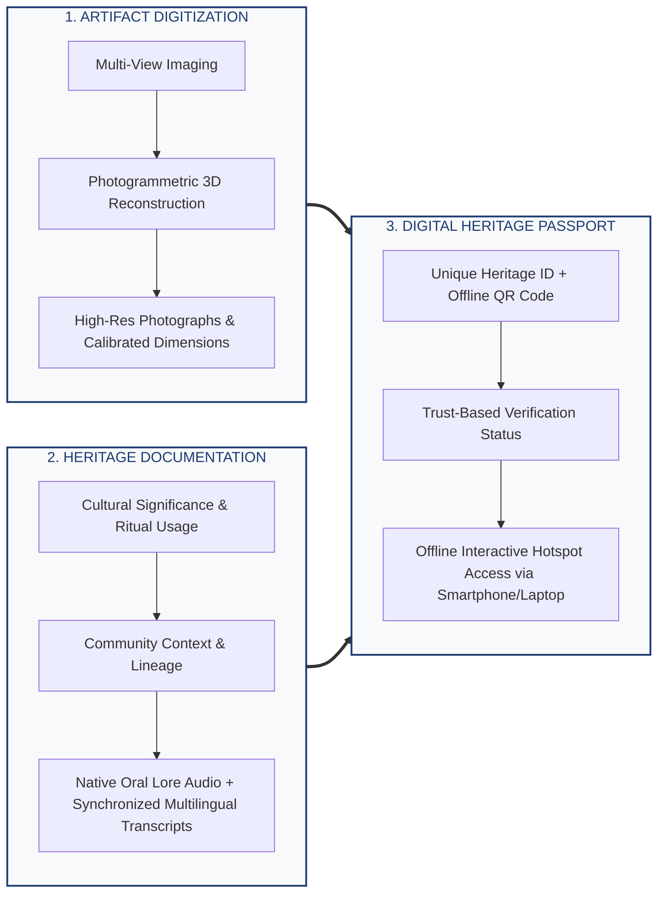
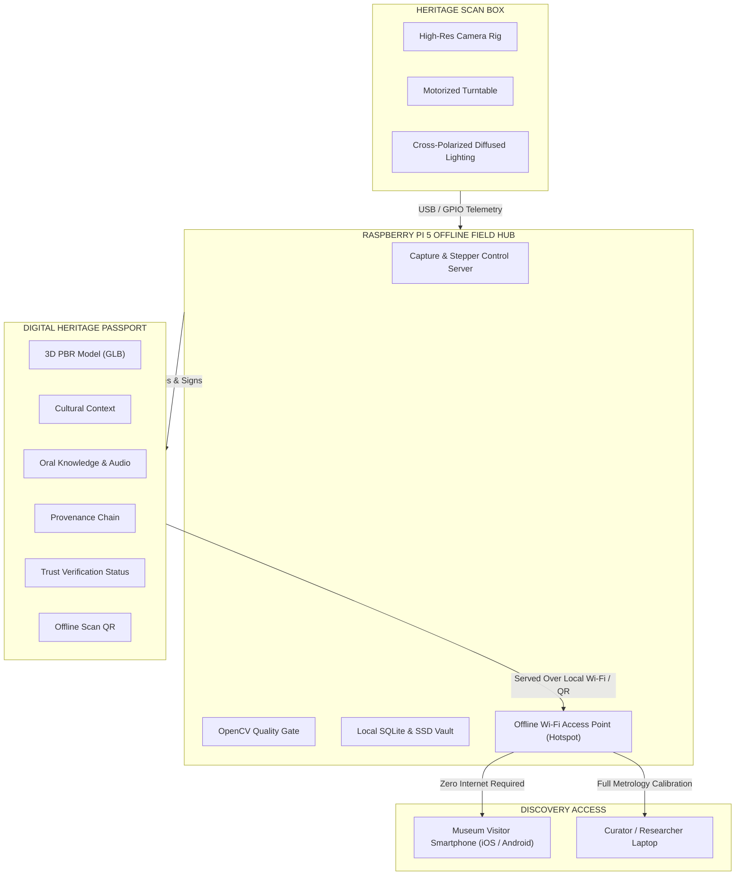
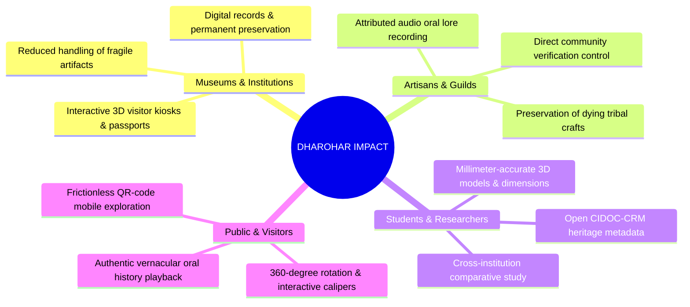

# 🏛️ DHAROHAR: Digital Heritage Artifact Recording, Oral History & Authenticated Records

<div align="center">

### **Smart India Hackathon 2026**
**Problem Statement ID:** `26214`  
**Problem Statement Title:** *Student Innovation - Ideas that showcase the rich cultural heritage and traditions of India*  
**Theme:** Heritage & Culture &bull; **PS Category:** Hardware  
**Team ID:** `169546` &bull; **Team Name:** `Sanjeevaani`  

---

> *"Preserve the artefact. Preserve the knowledge. Preserve it for the future."*

[](https://fastapi.tiangolo.com)
[](https://python.org)
[](https://opencv.org)
[](https://www.khronos.org/gltf/)
[](https://raspberrypi.com)

</div>

---

## 📌 Table of Contents
1. [Executive Summary & Problem Statement](#-executive-summary--problem-statement)
2. [Proposed Solution: The 3 Core Pillars](#-proposed-solution-the-3-core-pillars)
3. [Technical Approach & Architecture Diagrams](#-technical-approach--architecture-diagrams)
4. [Hardware & Software Specifications](#-hardware--software-specifications)
5. [Process Flow & Quality Gate Pipeline](#-process-flow--quality-gate-pipeline)
6. [Feasibility, Risks & Mitigation Strategies](#-feasibility-risks--mitigation-strategies)
7. [Impact, Key Benefits & Long-Term Value](#-impact-key-benefits--long-term-value)
8. [Research Basis & Prior Art Gap](#-research-basis--prior-art-gap)
9. [Heritage Catalog & Verified Records](#-heritage-catalog--verified-records)
10. [Quick Start & Live Interfaces](#-quick-start--live-interfaces)

---

## 🏛️ Executive Summary & Problem Statement

Across India, thousands of priceless cultural artifacts housed in regional museums, tribal clusters, and historical shrines lack comprehensive digital documentation. Traditional methods are either fragmented (only photographing 2D images without 3D metric accuracy) or dissociate the physical object from its **living oral traditions, community provenance, and craft lineage**. Furthermore, remote heritage sites frequently lack stable internet connectivity.

### The Solution: DHAROHAR
**DHAROHAR** (by Team **Sanjeevaani**) is a **Portable, Offline-First Digital Heritage Artifact Metrology and Knowledge Preservation System**. It combines non-contact optical scanning, automated turntable photogrammetry, real-time quality gating, and native oral lore capture into a unified **Digital Heritage Passport** accessible offline over a localized Raspberry Pi Wi-Fi hotspot.

```
   ┌────────────────────────────────────────────────────────────────────────┐
   │ "ONE PHYSICAL ARTIFACT ➔ ONE COMPLETE, TRACEABLE DIGITAL HERITAGE RECORD" │
   └────────────────────────────────────────────────────────────────────────┘
```

---

## 💡 Proposed Solution: The 3 Core Pillars

DHAROHAR is architected around three tightly integrated pillars:



1. **Artifact Digitization**: Multi-view synchronized capture, calibrated scale reference (ChArUco/ArUco #42), photogrammetric reconstruction, and watertight PBR `.glb` 3D generation.
2. **Heritage Documentation**: Capturing living cultural context, oral histories recorded directly from master artisans and elders, with transcription and translation powered by Indic AI tools.
3. **Digital Heritage Passport**: A tamper-evident digital identity card with QR code, verification ledger, provenance chain, and direct 3D inspection viewable on visitor phones without internet access.

---

## 🔬 Technical Approach & Architecture Diagrams

### 1. Technical Flow & System Architecture (Slide 3)

The following diagram illustrates the interaction between the **Hardware Layer**, **Software Layer**, and **Process Pipeline**, featuring parallel processing and automated quality gate feedback:

```mermaid
flowchart TD
    %% Styling & Classes
    classDef hw fill:#e8f4fd,stroke:#0284c7,stroke-width:2px,color:#0369a1;
    classDef sw fill:#fff7ed,stroke:#ea580c,stroke-width:2px,color:#c2410c;
    classDef step fill:#f0fdf4,stroke:#16a34a,stroke-width:2px,color:#15803d;
    classDef quality fill:#fef2f2,stroke:#dc2626,stroke-width:2px,color:#b91c1c;
    classDef parallel fill:#faf5ff,stroke:#9333ea,stroke-width:2px,color:#7e22ce;
    classDef endnode fill:#eef2ff,stroke:#4f46e5,stroke-width:2px,color:#3730a3;

    %% Start
    START([START: Physical Artifact])

    %% Main Process Flow
    subgraph PIPELINE ["DHAROHAR METROLOGY & PRESERVATION PIPELINE"]
        S1["1. CALIBRATION<br/>(ChArUco / ArUco Scale + Colour Checker)"]:::step
        S2["2. AUTOMATED CAPTURE<br/>(Synchronized Turntable 360° Rotation)"]:::step
        S3{"3. QUALITY GATE<br/>(Blur, Exposure, Fiducial Integrity)"}:::quality
        S4["4. 3D RECONSTRUCTION<br/>(SfM / MVS ➔ Point Cloud ➔ Mesh ➔ PBR GLB)"]:::step

        %% Parallel Processing Branch
        subgraph PARALLEL_PROCESSING ["PARALLEL PROCESSING ENGINE"]
            S5["5. CULTURAL METADATA<br/>(Significance, Material, Technique, Community)"]:::parallel
            S6["6. ORAL KNOWLEDGE PROCESSING<br/>(Audio Recording ➔ Whisper ➔ IndicTrans2)"]:::parallel
        end

        S7["7. PROVENANCE & VERIFICATION<br/>(Audit Ledger: Human-Entered vs AI-Suggested)"]:::step
        S8["8. DIGITAL HERITAGE RECORD<br/>(CIDOC-CRM / Dublin Core Schema, SQLite, SSD)"]:::step
        S9["9. DIGITAL HERITAGE PASSPORT<br/>(Unique Heritage ID + Embedded Offline QR)"]:::step
        S10["10. VISITOR SMARTPHONE / LAPTOP<br/>(Interactive 3D Three.js / Model-Viewer via Hotspot)"]:::endnode
    end

    %% Hardware Layer Elements
    subgraph HARDWARE_LAYER ["HARDWARE LAYER"]
        HW_CAM["📷 IMX477 / HQ Camera"]:::hw
        HW_LED["💡 Diffused LED + Polariser"]:::hw
        HW_TT["⚙️ NEMA 17 + Motorized Turntable"]:::hw
        HW_ESP["🎛️ ESP32 + TMC2209 Controller"]:::hw
        HW_PI["🍓 Raspberry Pi 5 (8 GB)"]:::hw
    end

    %% Software Layer Elements
    subgraph SOFTWARE_LAYER ["SOFTWARE LAYER"]
        SW_CTRL["💻 Capture Control Software (Python)"]:::sw
        SW_CV["👁️ OpenCV (Quality Gate & Blur Analysis)"]:::sw
        SW_COLMAP["📐 COLMAP / Meshroom (SfM + MVS)"]:::sw
        SW_AI["🗣️ Whisper + IndicTrans2 (Speech & Indic Translation)"]:::sw
        SW_BACK["⚡ FastAPI Backend + SQLite + SSD Engine"]:::sw
        SW_VIEW["🌐 Three.js / Google Model-Viewer"]:::sw
    end

    %% Hardware Connections
    HW_CAM -.-> S1
    HW_CAM -.-> S2
    HW_LED -.-> S2
    HW_TT -.-> S2
    HW_ESP -.-> HW_TT
    HW_PI -.-> SW_CTRL

    %% Software Connections
    SW_CTRL -.-> S1
    SW_CTRL -.-> S2
    SW_CV -.-> S3
    SW_COLMAP -.-> S4
    SW_AI -.-> S6
    SW_BACK -.-> S7
    SW_BACK -.-> S8
    SW_VIEW -.-> S10

    %% Main Process Progression
    START --> S1
    S1 --> S2
    S2 --> S3
    S3 -- "Pass: Valid Telemetry" --> S4
    S3 -- "Fail: Invalid / Blurry" -->|Feedback: Automated Recapture| S2
    S4 --> S5
    S4 --> S6
    S5 --> S7
    S6 --> S7
    S7 --> S8
    S8 --> S9
    S9 --> S10
```

---

### 2. Physical Scanning Box & Field Architecture (Slide 2)



---

## 🛠️ Hardware & Software Specifications

### Hardware Bill of Materials (Prototype ➔ Production)

| Component | Specification | Function in DHAROHAR |
|---|---|---|
| **Compute Core** | **Raspberry Pi 5 (8 GB RAM)** | Field orchestration, local storage, FastAPI server, Wi-Fi hotspot AP |
| **Motion Controller** | **ESP32 + TMC2209 SilentStepStick** | Micro-stepping turntable control, acceleration ramping, shutter trigger |
| **Optics & Imaging** | **Sony IMX477 / HQ Camera** | High-resolution multi-view photogrammetric capture (360° sequence) |
| **Rotational Drive** | **NEMA 17 Stepper Motor** | Precision 10° step rotations (36 frames per complete rotation) |
| **Lighting Envelope** | **Diffused 5500K CRI>95 LED + Linear Polariser** | Shadowless illumination, eliminates specular hotspots on metallic brass/bronze |
| **Optical Calibration** | **ChArUco 6×6 + ArUco #42 (50.0mm) + ColorChecker** | Camera intrinsic calibration, absolute millimeter scale, and delta-E color fidelity |
| **Primary Storage** | **1 TB NVMe SSD (via PCIe M.2 HAT)** | High-speed RAW frame buffering, Poisson point clouds, and audio archives |
| **Safety System** | **Optocoupled isolation, common grounding, emergency e-stop** | Protects fragile historic artifacts and ensures field hardware durability |

### Software Stack

| Domain | Technology / Library | Role & Integration |
|---|---|---|
| **Capture & Hardware** | `Python 3.12`, `OpenCV (cv2)`, `gpiozero` | Turntable synchronization, camera triggering, automated capture |
| **Quality Gate** | `OpenCV Laplacian Blur`, Exposure Histograms | Real-time reject/accept filtering (>100 sharpness threshold) |
| **3D Reconstruction** | `COLMAP` / `Meshroom (AliceVision)` | Structure-from-Motion (SfM), Multi-View Stereo (MVS), Poisson surface mesh |
| **3D Model Delivery** | `Khronos glTF 2.0 (.glb)` | Self-contained watertight binary mesh with embedded PBR metallic-roughness textures |
| **Backend & API** | `FastAPI`, `Uvicorn`, `WebSockets`, `Pydantic` | Real-time hardware control, streaming telemetry, RESTful metadata persistence |
| **Database & Metadata** | `SQLite 3`, JSON file-backed cache, `CIDOC-CRM` / `Dublin Core` | Transparent, auditable, portable catalog without external cloud requirements |
| **Oral Lore Voice AI** | `OpenAI Whisper`, `AI4Bharat IndicTrans2` | Native audio speech-to-text, regional language translation (Hindi, Tamil, etc.) |
| **Interactive Viewers** | Google `<model-viewer>`, `Three.js`, `Leaflet.js` | Web-based 3D orbital inspection, caliper measurement, GIS cultural mapping |

---

## 🔄 Process Flow & Quality Gate Pipeline

```mermaid
sequenceDiagram
    autonumber
    participant Art as Physical Artifact
    participant Box as Turntable Rig (ESP32 + Pi 5)
    participant QG as OpenCV Quality Gate
    participant SfM as 3D Engine (SfM / MVS)
    participant AI as Oral Lore & Metadata Engine
    participant Pass as Digital Heritage Passport
    participant Vis as Visitor / Curator Device

    Art->>Box: Placed on turntable with 50mm ArUco scale marker
    Box->>Box: Optical calibration (ChArUco & exposure balancing)
    loop 36 Turntable Steps (10° per step)
        Box->>Box: Rotate turntable 10° & fire synchronized shutter
        Box->>QG: Send captured frame for verification
        alt Blurry or Occluded Frame
            QG-->>Box: Reject frame (Variance < 100) ➔ Re-trigger step
        else Clear Frame
            QG-->>Box: Accept frame (Recorded into session queue)
        end
    end
    Box->>SfM: Transmit 36 validated frames
    SfM->>SfM: Sparse point cloud ➔ Dense cloud ➔ Watertight mesh ➔ PBR bake (.glb)
    par Parallel Documentation
        AI->>AI: Record elder/artisan oral history (.wav)
        AI->>AI: Speech-to-Text (Whisper) + Indic translation (IndicTrans2)
    and Provenance Validation
        AI->>Pass: Tag fields (HUMAN-ENTERED vs AI-SUGGESTED)
    end
    SfM->>Pass: Bind 3D Model (.glb) with caliper dimensions
    AI->>Pass: Bind transcript, audio lore, and GIS cultural origin
    Pass->>Pass: Generate cryptographic Heritage ID & QR Code
    Vis->>Pass: Scan QR Code via local Wi-Fi hotspot
    Pass->>Vis: Stream 3D viewer, audio room, and passport dossier
```

---

## ⚖️ Feasibility, Risks & Mitigation Strategies

### Feasibility Pillars (Slide 4)
1. **Proven Technologies**: COLMAP, Meshroom, OpenCV, and Raspberry Pi 5 are production-hardened, mature open-source tools.
2. **Low-Cost Modular Hardware**: Standardized NEMA 17 steppers, ESP32, and HQ camera reduce total unit bill-of-materials significantly below industrial 3D scanners.
3. **Non-Contact Optical Capture**: Artifacts are never handled or physically clamped during digitisation, preserving structural integrity.
4. **Split Processing Architecture**: Lightweight capture and metadata entry run locally on the Pi 5; dense multi-view stereo photogrammetry queues on an edge workstation or background GPU thread.
5. **Calibrated Reference in Every Scan**: 50.0mm ArUco #42 fiducials provide millimeter-level dimensional ground truth.
6. **Field-Ready & Offline-First**: Operates seamlessly in remote heritage locations without active internet connections.
7. **Trust-Aware Data Hierarchy**: Every field records whether it is `HUMAN-ENTERED`, `AI-SUGGESTED`, or `INSTITUTION-VERIFIED`.

### Challenges, Risks & Mitigation Matrix

| # | Challenge & Risk | Root Cause | Engineering Strategy to Overcome |
|---|---|---|---|
| **1** | **Glossy / Reflective Surfaces** | Specular glare on brass/bronze distorts feature matching | **Cross-polarised diffused LED lighting** and polarising filter over camera lens eliminate specular hotspots. |
| **2** | **Flat / Low-Texture Artifacts** | Lack of distinct visual keypoints for SfM matching | **2D high-resolution orthographic macro fallback mode** with raking directional light for surface relief. |
| **3** | **Motion Blur & Frame Gaps** | Stepper vibration or insufficient frame overlap | **Soft-start S-curve acceleration**, turntable dwell delay, and **automated OpenCV Laplacian quality gate** flagging blur for instant recapture. |
| **4** | **Inaccurate Scale or Color** | Distance ambiguity and lighting variations | **ChArUco / ArUco physical targets and 24-patch color calibration chart** in the field of view of every scan. |
| **5** | **Heavy Dense 3D Computation** | High computational load of Poisson reconstruction on SBC | **Decoupled pipeline**: Pi 5 handles capture, storage, and low-poly preview; dense MVS reconstruction syncs to edge/CUDA workstation. |
| **6** | **Fragile Artifacts in Remote Sites** | Handling risk and zero cellular connectivity | **Stationary non-contact turntable enclosure** + **offline SSD storage** and zero-dependency local Wi-Fi access point. |
| **7** | **Unverified / Sensitive Knowledge** | Sacred tribal lore entered without validation | **Strict provenance chain**: AI transcriptions default to `AI-SUGGESTED` until approved by verified community elders. Granular privacy tiers (`PUBLIC`, `RESTRICTED`, `PRIVATE`). |

### Viability Matrix

```
┌─────────────────┬───────────────────────────────┬─────────────────────────────────┬─────────────────────────────┐
│ Target Adopters │ Cost Profile                  │ Sustainability & Maintenance    │ Phased Rollout Plan         │
├─────────────────┼───────────────────────────────┼─────────────────────────────────┼─────────────────────────────┤
│ State Museums,  │ Highly cost-effective         │ Modular COTS components,        │ Phase 1: Tabletop Prototype │
│ ASI, Archives,  │ open-source architecture;     │ open file standards (glTF/JSON),│ Phase 2: Regional Field Hub │
│ Tribal Guilds   │ under ₹35,000 per field unit  │ NVMe SSD local backup & sync    │ Phase 3: National Network   │
└─────────────────┴───────────────────────────────┴─────────────────────────────────┴─────────────────────────────┘
```

---

## 🌟 Impact, Key Benefits & Long-Term Value

### Impact Across Stakeholder Groups (Slide 5)



### Comprehensive Benefits Matrix

| Domain | Key Preservation Benefit |
|---|---|
| **Social & Cultural** | Safeguards intangible oral heritage and cultural memory alongside physical form; empowers artisan communities. |
| **Educational & Research** | Democratizes access to high-fidelity 3D models for archaeology scholars and design students nationwide. |
| **Economic & Institutional**| Lowers museum digitisation costs by over 80% compared to proprietary industrial 3D scanning solutions. |
| **Physical Preservation** | Eliminates repeated handling, measuring, and transport of delicate centuries-old terracotta, wood, and gilded bronzes. |

### Future Scope
1. **Field Deployment**: Scaling from single-scanner tabletop units to portable backpack kits deployed across tribal clusters.
2. **Multilingual Access**: Expanding IndicTrans2 neural translation across all 22 official Eighth Schedule Indian languages.
3. **Advanced 3D Visualization**: Integrating **3D Gaussian Splatting (3DGS)** for photorealistic real-time rendering of intricate jewelry and reflective patina.
4. **National Central Heritage Repository**: Cloud-synchronized distributed ledger federating regional scans into the national digital heritage grid.

---

## 📚 Research Basis & Prior Art Gap

### Research Foundations (Slide 6)
- **JATAN / Museums of India**: National museum collections portal reference for structured cataloging and accession data fields.
- **IGNCA (Indira Gandhi National Centre for the Arts)**: Guidelines on intangible cultural heritage and documentation of living traditions.
- **COLMAP (Schönberger et al.)**: State-of-the-art Structure-from-Motion (SfM) and Multi-View Stereo (MVS) algorithms.
- **AliceVision Meshroom**: Open-source photogrammetric pipeline principles for turntable calibration.
- **OpenCV Computer Vision**: Robust sub-pixel corner detection, ArUco fiducial pose estimation, and frequency-domain blur filtering.
- **AI4Bharat IndicTrans2**: Transformer-based neural machine translation specifically tuned for low-resource Indian languages.

### Prior Art & The Research Gap
```
Existing Solutions:
  [Museum Databases (JATAN)] ─── Only 2D images, textual cards, no integrated 3D metrology.
  [Commercial 3D Scanners]   ─── Expensive, proprietary formats, zero cultural or oral lore capture.
  [Online 3D Repositories]   ─── Cloud-dependent, disconnects physical artifact from living artisans.
                      ▼
The DHAROHAR Integrated Innovation:
  Seamlessly unifies Hardware Photogrammetry + Real-time Quality Gate + Living Oral Lore 
  + Progressive Verification + Offline-First Digital Heritage Passport in a single portable unit.
```

---

## 🗄️ Heritage Catalog & Verified Records

Pre-seeded in the DHAROHAR database with full 3D models, photogrammetric recordings, calibrated dimensions, and oral audio:

| Artifact ID | Artifact Name | Period / Style | Community / Region | Verification Level | 3D Asset |
|---|---|---|---|---|---|
| **`DH-IND-0001`** | **Golden Buddha Head in Dhyana Mudra** | Gupta / Pala (5th–8th c. CE) | Nalanda / Sarnath Monastic Guild | `INSTITUTION-VERIFIED` | [buddha.glb](static/assets/models/buddha.glb) |
| **`DH-IND-0002`** | **Chola Bronze Nataraja** | Chola Classical (10th–11th c. CE) | Swamimalai Sthapathi Guild, TN | `INSTITUTION-VERIFIED` | [nataraja.glb](static/assets/models/nataraja.glb) |
| **`DH-IND-0003`** | **Bankura Terracotta Horse** | Folk Votive Earthenware | Panchmura Kumbhakar Guild, WB | `COMMUNITY-PROVIDED` | [terracotta_horse.glb](static/assets/models/terracotta_horse.glb) |
| **`DH-IND-0004`** | **Kutch Rogan Castor-Art Textile** | Endangered Fabric Craft | Khatri Master Artisans, Nirona, GJ | `SOURCE-VERIFIED` | High-Res Orthographic |
| **`DH-IND-0005`** | **Bidriware Silver Inlay Huqqa Base** | Bidar Zinc-Copper Inlay (17th c.) | Quadri Guild, Bidar, Karnataka | `INSTITUTION-VERIFIED` | [huqqa_base.glb](static/assets/models/huqqa_base.glb) |

---

## 🚀 Quick Start & Live Interfaces

### 1. Installation
```bash
# Clone the repository
git clone https://github.com/rupesh0411/SANJEEVAANI-PS26214-DHAROHAR.git
cd SANJEEVAANI-PS26214-DHAROHAR

# Install dependencies
pip install fastapi uvicorn opencv-python pillow numpy websockets pydantic
```

### 2. Launch DHAROHAR Server
```bash
python run_server.py
```

### 3. Open Web Interfaces
- 🖥️ **Master Command Center & Scanner Studio**: [`http://localhost:8000/`](http://localhost:8000/)
- 🔬 **3D Laboratory & Structural Caliper Inspector**: [`http://localhost:8000/viewer.html?id=DH-IND-0001`](http://localhost:8000/viewer.html?id=DH-IND-0001)
- 📱 **Visitor Mobile Digital Heritage Passport**: [`http://localhost:8000/passport.html?id=DH-IND-0001`](http://localhost:8000/passport.html?id=DH-IND-0001)
- 🗺️ **GIS Cultural Origin & Provenance Map**: [`http://localhost:8000/map.html`](http://localhost:8000/map.html)
- 📚 **Interactive Swagger API Documentation**: [`http://localhost:8000/docs`](http://localhost:8000/docs)

---

<div align="center">

**Smart India Hackathon 2026 &bull; Problem Statement ID: 26214**  
*Developed with pride by Team Sanjeevaani (Team ID: 169546)*  

</div>
